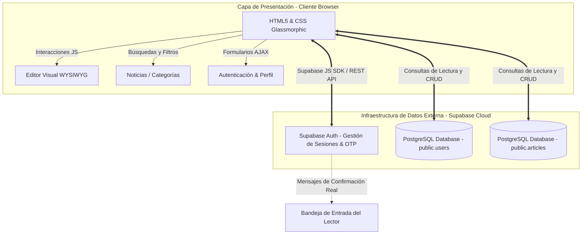

# ⚡ TECHLOG: Blog Tecnológico Automatizado con Panel de Administración

TECHLOG es un sistema web moderno de publicación y lectura de noticias tecnológicas de alta calidad. La plataforma cuenta con autenticación segura, control de accesos basado en roles (Lectores, Editores y Administradores), un editor de contenido visual e interactivo (WYSIWYG) en tiempo real, y un sistema integrado de verificación de correos a través de Gmail (modo SMTP real o simulación de desarrollo local).

---

## 🎯 Objetivos del Proyecto

### ¿Qué problema resuelve?
Actualmente, los creadores de contenido tecnológico requieren plataformas ágiles que les permitan redactar de manera visual y publicar contenido instantáneamente sin necesidad de interactuar directamente con la base de datos o herramientas de código. Además, los lectores exigen interfaces rápidas y estéticas diseñadas para evitar la fatiga visual. 

TECHLOG resuelve estos retos unificando:
1. **Un gestor de contenidos simplificado** (CMS) con un editor visual que soporta formato markdown y previsualización interactiva al instante.
2. **Seguridad y Control**: Un sistema de control de usuarios estricto para evitar publicaciones maliciosas mediante verificación por correo y un administrador que aprueba y gestiona los roles de los escritores.
3. **Una Experiencia Premium**: Una interfaz web responsiva, fluida y oscura optimizada para lectura en pantallas.

### Alcance de la Aplicación
*   **Módulo Público**: Buscador de noticias en tiempo real, filtros interactivos por categorías de tecnología (Inteligencia Artificial, Software, Hardware y Ciberseguridad), y lectura dinámica de noticias.
*   **Módulo de Autenticación**: Registro seguro de lectores con hash de contraseñas y envío de códigos de verificación de 6 dígitos (modo simulado o SMTP real).
*   **Panel Administrativo**:
    *   **Escritores/Editores**: Panel para crear, editar, previsualizar y eliminar noticias utilizando un editor visual interactivo.
    *   **Administrador**: Control total sobre noticias y un gestor dinámico de roles de usuarios para ascender o descender accesos (`Reader` ➔ `Editor` ➔ `Admin`) instantáneamente.
    *   **Buzón Virtual**: Visualizador local de correos electrónicos de verificación generados por la app pa## 🏗️ Arquitectura del Software

TECHLOG está diseñado bajo una **arquitectura Serverless de 1 Capa**, lo que significa que el frontend (cliente estático en el navegador) interactúa directamente con los servicios en la nube de **Supabase** para gestionar la persistencia y la autenticación. Esto elimina por completo la necesidad de un servidor de backend intermedio (como Flask o Express), garantizando la máxima portabilidad, velocidad y facilidad de despliegue.



### Flujo de Funcionamiento:
1.  **Lectura y Búsqueda**: El usuario consulta el frontend. El script `main.js` realiza llamadas asíncronas directamente a la API REST de **Supabase** (`public.articles` y `public.users`) usando el SDK cliente para recuperar las noticias ordenadas por fecha con sus respectivos autores.
2.  **Registro y Verificación**:
    *   El usuario se registra mediante el servicio nativo de autenticación de Supabase (`supabase.auth.signUp`). Esto crea la cuenta en la tabla protegida `auth.users`.
    *   Un **Trigger en PostgreSQL** (`on_auth_user_created`) se dispara automáticamente en Supabase e inserta el perfil correspondiente en la tabla pública de usuarios (`public.users`) con el rol inicial de `'Reader'`.
    *   Supabase envía un correo de confirmación real con un código OTP de 6 dígitos al correo del usuario.
    *   El usuario ingresa el código OTP en la vista de verificación (`verify.html`) y se activa su sesión mediante `supabase.auth.verifyOtp`.
3.  **Roles y Administración**: Los permisos se gestionan leyendo el rol del perfil del usuario en la base de datos pública. El administrador principal puede gestionar roles y ascender o descender cuentas, lo que actualiza la base de datos de Supabase en tiempo real.

---

## 💻 Stack Tecnológico & Arquitectura Estática (GitHub Pages)

La aplicación es un **sistema 100% estático (Serverless)**, lo que optimiza el rendimiento y permite un despliegue inmediato en cualquier hosting estático.

*   **Despliegue (GitHub Pages)**: Totalmente compatible. Al estar el archivo `index.html` en la raíz del repositorio, GitHub Pages lo cargará de forma automática como página de inicio principal sin requerir configuración adicional de servidores backend.
*   **Base de Datos e Infraestructura**: **Externa** mediante **Supabase (Relacional PostgreSQL)**. La persistencia se basa en un motor relacional en la nube.
*   **Autenticación**: Nativa de Supabase Auth, reemplazando el hashing del servidor y los cookies de sesión tradicionales por tokens JWT del lado del cliente.
*   **Frontend**:
    *   **HTML5 Semántico**: Estructura de marcado moderna optimizada para accesibilidad y SEO.
    *   **Vanilla CSS**: Hoja de estilos premium hecha a mano utilizando variables de diseño, estética oscura neon con efectos *Glassmorphism* (`backdrop-filter`) y micro-animaciones.
    *   **JavaScript Nativo (ES6)**: Integrado con el SDK de Supabase (`@supabase/supabase-js`) cargado vía CDN para realizar operaciones asíncronas (async/await).

---

## 🗄️ Modelo de Datos

TECHLOG utiliza una base de datos **Relacional PostgreSQL** externa alojada en **Supabase** para garantizar persistencia y seguridad multiusuario en tiempo real.

```
                  ┌─────────────────┐
                  │   AUTH.USERS    │ (Esquema interno Supabase)
                  ├─────────────────┤
                  │ id (PK - UUID)  │
                  │ email (UNIQUE)  │
                  └─────────────────┘
                           │
                           │ 1:1 (Relación de Perfil)
                           ▼
                  ┌─────────────────┐
                  │  PUBLIC.USERS   │ (Esquema público)
                  ├─────────────────┤
                  │ id (PK - UUID)  │ 1
                  │ email (UNIQUE)  │ ───┐
                  │ role            │    │
                  │ nickname        │    │
                  │ fullname        │    │
                  │ phone           │    │
                  │ photo_url       │    │
                  │ bio             │    │
                  │ created_at      │    │
                  └─────────────────┘    │
                                         │
                                         │ 1:N (Autoría de noticias)
                                         │
                                         ▼
                  ┌─────────────────┐    N
                  │ PUBLIC.ARTICLES │
                  ├─────────────────┤ ───┘
                  │ id (PK - BIGINT)│
                  │ title           │
                  │ content         │
                  │ summary         │
                  │ category        │
                  │ author_id (FK)  │
                  │ image_url       │
                  │ created_at      │
                  │ updated_at      │
                  └─────────────────┘
```

### Detalle de las Tablas:
1.  **`public.users`**:
    *   `id` (UUID, Llave Primaria, Referencia a `auth.users.id` con eliminación en cascada)
    *   `email` (TEXT, Único, No Nulo)
    *   `role` (TEXT, por defecto 'Reader', valores: 'Reader', 'Editor', 'Admin')
    *   `nickname` (TEXT, apodo público)
    *   `fullname` (TEXT, nombre real completo)
    *   `phone` (TEXT, teléfono de contacto)
    *   `photo_url` (TEXT, enlace de imagen de avatar)
    *   `bio` (TEXT, biografía resumida)
    *   `created_at` (TIMESTAMP WITH TIME ZONE, fecha de registro)
2.  **`public.articles`**:
    *   `id` (BIGINT, Llave Primaria, Auto-incremental por identidad)
    *   `title` (TEXT, No Nulo)
    *   `content` (TEXT, Cuerpo de la noticia en formato markdown, No Nulo)
    *   `summary` (TEXT, Resumen corto, No Nulo)
    *   `category` (TEXT, categorías: 'IA', 'Software', 'Hardware', 'Ciberseguridad')
    *   `author_id` (UUID, Llave Foránea hacia `public.users.id` con eliminación en cascada)
    *   `image_url` (TEXT, enlace a imagen representativa)
    *   `created_at` (TIMESTAMP WITH TIME ZONE, fecha de creación)
    *   `updated_at` (TIMESTAMP WITH TIME ZONE, fecha de última modificación)

---

## 🤖 Metodología con IA: Aceleración de Código con Antigravity & Gemini

El desarrollo de este repositorio fue potenciado y acelerado por la inteligencia artificial **Antigravity** impulsada por **Gemini 3.5 Flash** de Google DeepMind.

### ¿Cómo se empleó la IA en el proyecto?
1.  **Diseño Arquitectónico Moderno**: La IA estructuró la base de datos relacional y el flujo de autenticación basándose en las restricciones de software detectadas localmente (entorno Windows sin Node.js ni PHP preinstalados, empleando Python de manera óptima).
2.  **Generación y Refactorización Limpia**: Escritura de código backend modular y frontend reactivo siguiendo estándares premium de CSS (Glassmorphism) con una estructuración semántica impecable.
3.  **Soluciones Adaptativas Inteligentes**: Creación de un script dinámico en Python para interactuar con la **API de GitHub** y subir los archivos de forma atómica debido a la ausencia de Git CLI en la máquina local.
4.  **Sistema Dual de Verificación**: Desarrollo de un mock mailer interactivo en pantalla para agilizar las pruebas y depuración del sistema de verificación por correo sin forzar configuraciones complejas de SMTP al usuario.
5.  **Verificación y Pruebas**: Auditoría del funcionamiento general de la app antes de completar el plan de despliegue.
