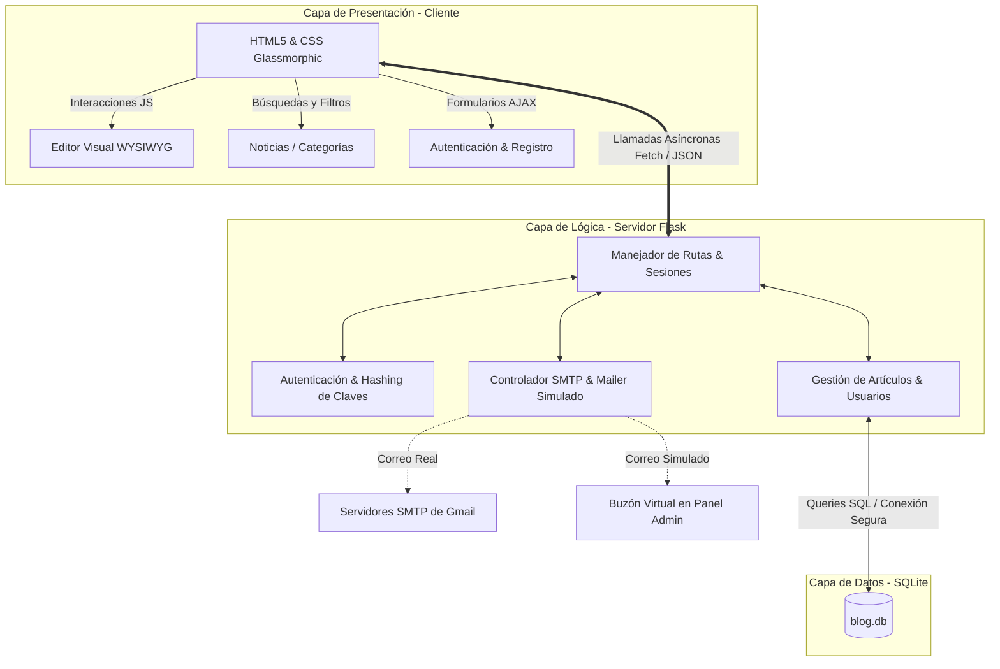

# ⚡ TECHLOG: Blog Tecnológico Automatizado con Panel de Administración

TECHLOG es un sistema web moderno de publicación y lectura de noticias tecnológicas de alta calidad. La plataforma cuenta con autenticación segura, control de accesos basado en roles (Lectores, Editores y Administradores), un editor de contenido visual e interactivo (WYSIWYG) en tiempo real, y un sistema integrado de verificación de correos a través de Gmail (modo SMTP real o simulación de desarrollo local).

---

## 🎯 Objetivos del Proyecto

### ¿Qué problema resuelve?
Actualmente, los creadores de contenido tecnológico requieren plataformas ágiles que les permitan redactar de manera visual y publicar contenido instantáneamente sin necesidad de interactuar directamente con la base de datos o herramientas de código. Además, los lectores exigen interfaces rápidas y estéticas diseñadas para evitar la fatiga visual. 

TECHLOG resuelve estos retos unificando:
1. **Un gestor de contenidos simplificado** (CMS) con un editor visual que soporta formato markdown y previsualización interactiva al instante.
2. **Seguridad y Control**: Un sistema de control de usuarios estricto para evitar publicaciones maliciosas mediante verificación por correo y un administrador que aprueba y gestiona los roles de los escritores.
3. **Una Experiencia Premium**: Una interfaz web responsiva, fluida y oscura optimizada para lectura en pantallas.

### Alcance de la Aplicación
*   **Módulo Público**: Buscador de noticias en tiempo real, filtros interactivos por categorías de tecnología (Inteligencia Artificial, Software, Hardware y Ciberseguridad), y lectura dinámica de noticias.
*   **Módulo de Autenticación**: Registro seguro de lectores con hash de contraseñas y envío de códigos de verificación de 6 dígitos (modo simulado o SMTP real).
*   **Panel Administrativo**:
    *   **Escritores/Editores**: Panel para crear, editar, previsualizar y eliminar noticias utilizando un editor visual interactivo.
    *   **Administrador**: Control total sobre noticias y un gestor dinámico de roles de usuarios para ascender o descender accesos (`Reader` ➔ `Editor` ➔ `Admin`) instantáneamente.
    *   **Buzón Virtual**: Visualizador local de correos electrónicos de verificación generados por la app para facilitar las pruebas de desarrollo.

---

## 🏗️ Arquitectura del Software

TECHLOG está diseñado bajo una arquitectura monolítica modular, lo que simplifica su despliegue y minimiza las dependencias externas, logrando un rendimiento óptimo.



### Flujo de Funcionamiento:
1.  **Lectura y Búsqueda**: El usuario consulta el frontend. El script `main.js` intercepta filtros o búsquedas y el servidor Flask recupera los datos desde **SQLite** estructuradamente.
2.  **Registro y Verificación**:
    *   El usuario se registra, se genera un hash seguro de su clave y un código aleatorio de 6 dígitos.
    *   Si hay credenciales SMTP en `.env`, se envía un correo real a través de Gmail; si no, el correo se simula localmente y se registra en el **Buzón Virtual** en el Panel Admin.
    *   El usuario introduce el código y su cuenta se marca como activa.
3.  **Roles y Administración**: El administrador puede acceder a la lista de usuarios y ascenderlos. Flask valida mediante decoradores y middleware de sesión que solo los usuarios autorizados ejecuten acciones destructivas en la base de datos.

---

## 💻 Stack Tecnológico & Arquitectura Estática (GitHub Pages)

La aplicación soporta **dos modos de ejecución** para garantizar la máxima portabilidad:

1. **Modo Estático / Servidor Cliente (Recomendado para GitHub Pages)**:
   * **Ubicación**: En la raíz del repositorio (`index.html`, `admin.html`, etc.).
   * **Persistencia**: Se gestiona una base de datos local simulada en el navegador usando `localStorage`.
   * **Despliegue**: Totalmente compatible con **GitHub Pages**. Al estar el archivo `index.html` en la raíz del repositorio, GitHub Pages lo cargará de forma automática como página de inicio principal sin requerir configuración adicional de servidores.

2. **Modo Dinámico / Servidor Flask (Python + SQLite)**:
   * **Ubicación**: Lógica de servidor en `app.py` y plantillas Jinja2 en `templates/`.
   * **Base de Datos**: SQLite (`blog.db`) local.
   * **Despliegue**: Diseñado para plataformas que admiten ejecución de scripts en backend (como Heroku, Render o servidores VPS).

*   **Frontend**:
    *   **HTML5 Semántico**: Estructura de marcado moderna optimizada para accesibilidad y SEO.
    *   **Vanilla CSS**: Hoja de estilos premium hecha a mano utilizando variables de diseño, estética oscura neon con efectos *Glassmorphism* (`backdrop-filter`) y micro-animaciones en tarjetas y botones.
    *   **JavaScript Nativo (ES6)**: Control reactivo de vistas, operaciones de almacenamiento en `localStorage`, e integración dinámica de vistas y markdown.
*   **Control del Repositorio**:
    *   **Git REST API**: Script en Python (`git_push.py`) para la sincronización remota e integración con GitHub a través del token personal en entornos sin Git CLI instalado.


---

## 🗄️ Modelo de Datos

TECHLOG utiliza una base de datos **Relacional SQLite** (`blog.db`) almacenada de forma **interna** en la raíz de la aplicación para garantizar portabilidad inmediata.

```
                  ┌─────────────────┐
                  │      USERS      │
                  ├─────────────────┤
                  │ id (PK)         │ 1
                  │ email (UNIQUE)  │ ───┐
                  │ password_hash   │    │
                  │ role            │    │
                  │ is_verified     │    │
                  │ verification_co │    │
                  │ created_at      │    │
                  └─────────────────┘    │
                                         │
                                         │ 1:N (Autoría)
                                         │
                                         ▼
                  ┌─────────────────┐    N
                  │    ARTICLES     │
                  ├─────────────────┤ ───┘
                  │ id (PK)         │
                  │ title           │
                  │ content         │
                  │ summary         │
                  │ category        │
                  │ author_id (FK)  │
                  │ image_url       │
                  │ created_at      │
                  │ updated_at      │
                  └─────────────────┘
```

### Detalle de las Tablas:
1.  **`users`**:
    *   `id` (INTEGER, Llave Primaria, Auto-incremental)
    *   `email` (TEXT, Único, No Nulo)
    *   `password_hash` (TEXT, Hashed mediante PBKDF2:SHA256, No Nulo)
    *   `role` (TEXT, por defecto 'Reader', valores: 'Reader', 'Editor', 'Admin')
    *   `is_verified` (INTEGER, 0=Pendiente, 1=Verificado)
    *   `verification_code` (TEXT, código temporal de 6 dígitos)
    *   `created_at` (TIMESTAMP, fecha de registro)
2.  **`articles`**:
    *   `id` (INTEGER, Llave Primaria, Auto-incremental)
    *   `title` (TEXT, No Nulo)
    *   `content` (TEXT, Cuerpo del artículo, No Nulo)
    *   `summary` (TEXT, Resumen corto, No Nulo)
    *   `category` (TEXT, categorías: 'IA', 'Software', 'Hardware', 'Ciberseguridad')
    *   `author_id` (INTEGER, Llave Foránea hacia `users.id` con eliminación en cascada)
    *   `image_url` (TEXT, enlace a imagen representativa)
    *   `created_at` (TIMESTAMP, fecha de creación)
    *   `updated_at` (TIMESTAMP, fecha de última modificación)

---

## 🤖 Metodología con IA: Aceleración de Código con Antigravity & Gemini

El desarrollo de este repositorio fue potenciado y acelerado por la inteligencia artificial **Antigravity** impulsada por **Gemini 3.5 Flash** de Google DeepMind.

### ¿Cómo se empleó la IA en el proyecto?
1.  **Diseño Arquitectónico Moderno**: La IA estructuró la base de datos relacional y el flujo de autenticación basándose en las restricciones de software detectadas localmente (entorno Windows sin Node.js ni PHP preinstalados, empleando Python de manera óptima).
2.  **Generación y Refactorización Limpia**: Escritura de código backend modular y frontend reactivo siguiendo estándares premium de CSS (Glassmorphism) con una estructuración semántica impecable.
3.  **Soluciones Adaptativas Inteligentes**: Creación de un script dinámico en Python para interactuar con la **API de GitHub** y subir los archivos de forma atómica debido a la ausencia de Git CLI en la máquina local.
4.  **Sistema Dual de Verificación**: Desarrollo de un mock mailer interactivo en pantalla para agilizar las pruebas y depuración del sistema de verificación por correo sin forzar configuraciones complejas de SMTP al usuario.
5.  **Verificación y Pruebas**: Auditoría del funcionamiento general de la app antes de completar el plan de despliegue.
